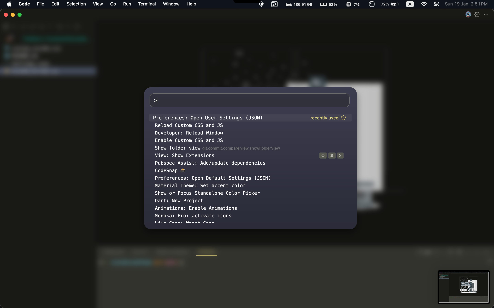
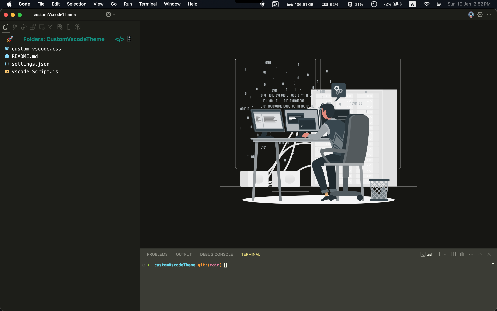
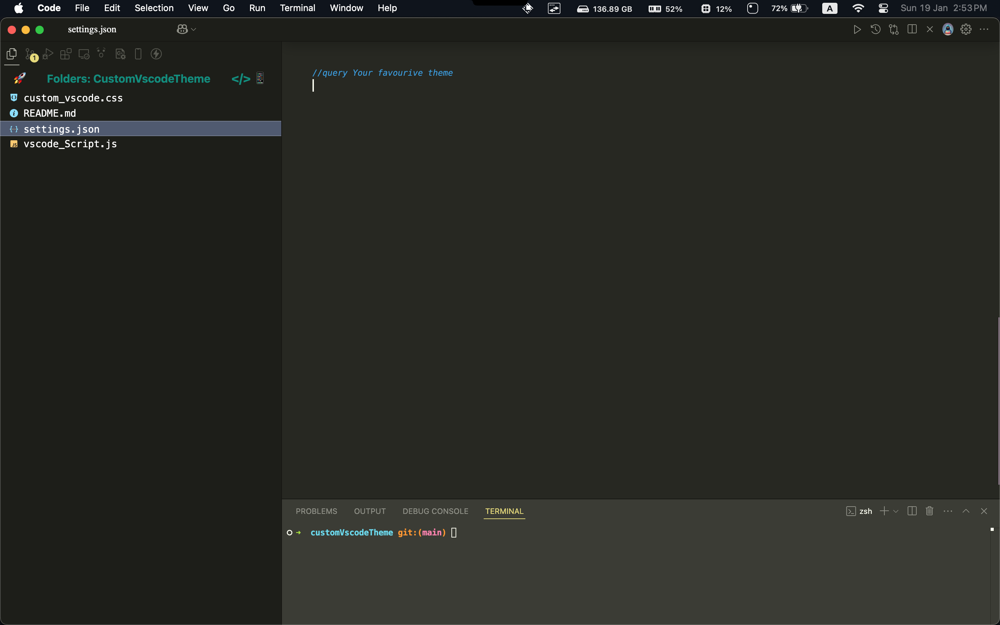

# Custom VSCode Theme

This guide will help you set up a custom VSCode theme using the provided `custom_vscode.css`, `vscode_Script`, and `settings.json` files.

## Prerequisites

- Visual Studio Code installed on your machine.
- Basic knowledge of how to navigate and edit files in VSCode.







## Steps to Apply the Custom Theme

1. **Locate the Custom Files**

  Ensure you have the following files in your project directory:
  - `custom_vscode.css`
  - `vscode_Script`
  - `settings.json`

2. **Modify VSCode Settings**

  - Open your VSCode settings by navigating to `File > Preferences > Settings` or using the shortcut `Ctrl + ,`.
  - Click on the `{}` icon in the top right corner to open the `settings.json` file.

3. **Update settings.json**

  - Copy the contents of the provided `settings.json` file and paste it into your VSCode `settings.json` file. This will configure VSCode to use the custom theme.

4. **Apply the Custom CSS**

  - Open the command palette by pressing `Ctrl + Shift + P` and type `Developer: Open Webview Developer Tools`.
  - In the developer tools, go to the `Sources` tab and locate the `custom_vscode.css` file.
  - Copy the contents of `custom_vscode.css` and paste it into the appropriate section in the developer tools.

5. **Run the Custom Script**

  - Open a terminal in VSCode by navigating to `View > Terminal` or using the shortcut `` Ctrl + ` ``.
  - Run the provided `vscode_Script` to apply any additional customizations.

6. **Restart VSCode**

  - Close and reopen VSCode to see the changes take effect.

## Adding a Custom Background to Your UI

1. **Convert Your Image to SVG**

  - Ensure your image is in SVG format. If it is not, convert it using any online converter.

2. **Convert SVG to CSS**

  - Use [this link](https://bloggerpilot.com/en/tools/svg-to-css/) to convert your SVG image to CSS code.

## Troubleshooting

- If the theme does not apply correctly, ensure that all paths in the `settings.json` file are correct.
- Make sure you have the necessary permissions to modify the VSCode settings and files.

Enjoy your new custom VSCode theme!

## Additional Configuration

To ensure that VSCode correctly loads your custom CSS and JavaScript files, you need to add the following settings to your `settings.json` file:

```json
{
  "vscode_custom_css.imports": [
   "file:///path/to/your/custom_vscode.css",
   "file:///path/to/your/vscode_Script"
  ],
  "vscode_custom_css.policy": true
}
```

### Explanation

- **`vscode_custom_css.imports`**: This setting specifies the paths to your custom CSS and JavaScript files. Replace `/path/to/your/` with the actual path to your `custom_vscode.css` and `vscode_Script` files.
- **`vscode_custom_css.policy`**: This setting must be set to `true` to allow VSCode to load custom CSS and JavaScript files.

By adding these settings, you ensure that VSCode will import and apply your custom styles and scripts every time it starts.

Make sure to restart VSCode after making these changes for them to take effect. 👾
